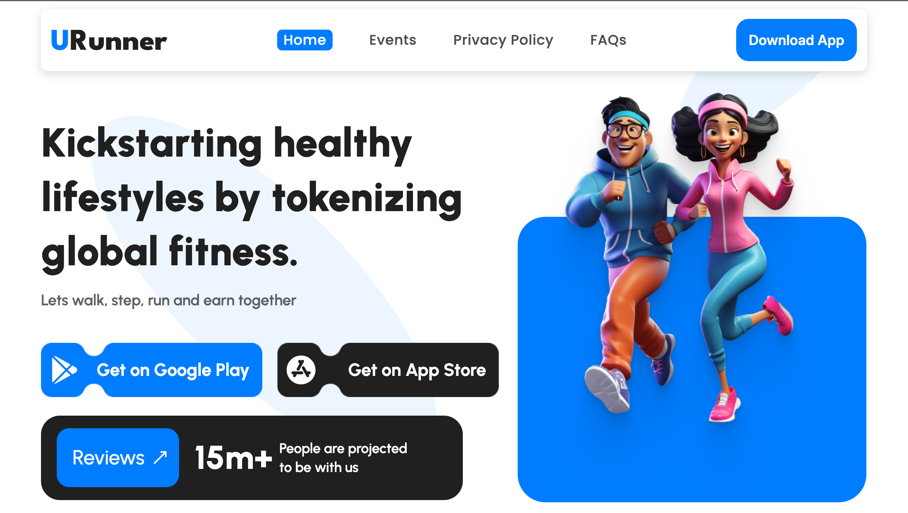
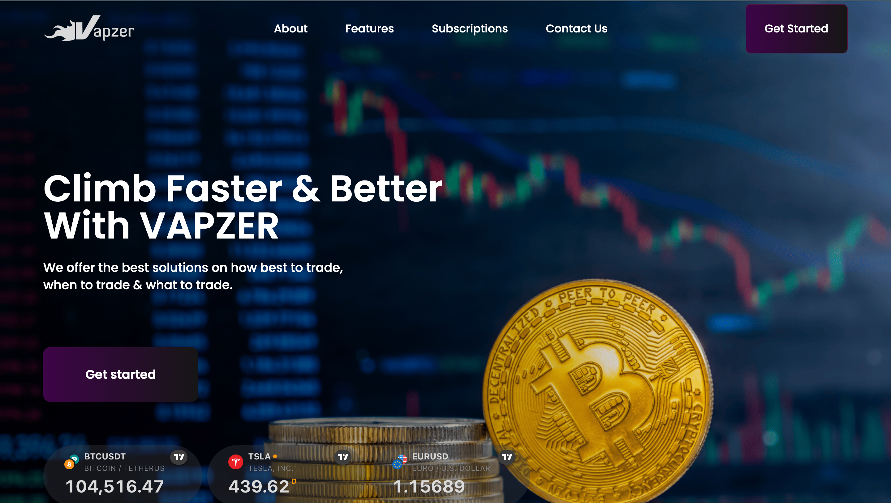
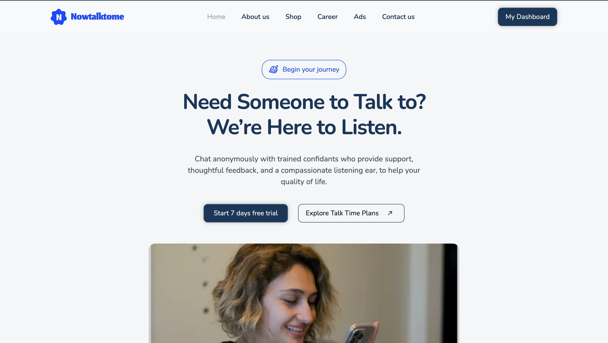

# Hi, I'm Igbagbo Olaleye 👋

**Full-Stack Engineer** specializing in React, TypeScript, and scalable web applications with AI/ML integration.

Currently building microservices and real-time systems at **UnifiedBeez (London)** and **Vapzer LLC (California)**.

---

## 🚀 Featured Projects

### [Urunner](https://www.urunner.io) | Fitness Tokenization Platform
**Tech Stack:** Next.js • TypeScript • Tailwind • Python Backend

- Built frontend website and admin dashboard for global fitness platform
- Developed event management system with seamless API integration
- Implemented responsive, mobile-first design for fitness tracking features

🔗 [Live Site](https://www.urunner.io)

---

### [Vapzer Trading Platform](https://webappfrontend-1.onrender.com/)
**Tech Stack:** Next.js • TypeScript • Tailwind • Django • C#

- Led frontend development consuming Python/Django and C# APIs
- Converted desktop charting features to web for market trend analysis
- Built complex data visualization components for financial trading

🔗 [Live Demo](https://webappfrontend-1.onrender.com/)

---

### [NowTalkToMe](https://www.nowtalktome.com) | Real-Time Chat Platform
**Tech Stack:** NestJs • TypeScript • Socket.io • MySQL • React • Stripe

- Led 6-person team building encrypted chat platform with **1K+ concurrent sessions**
- Built admin dashboard with live monitoring and dynamic staff assignment
- Integrated Stripe payment processing (**$50K+ monthly transactions**)
- Implemented WebSocket microservices with automated load balancing

🔗 [Live Platform](https://www.nowtalktome.com)

---

### [EchoNota](https://echonota.vercel.app/) | Podcast Transcription Platform
**Tech Stack:** Next.js • TypeScript • Audio Processing

- Contributed to voice transcription web application (Avaris AS)
- Implemented UI/UX improvements for transcription preview
- Optimized layout and user flow for audio content management

🔗 [Live App](https://echonota.vercel.app/)

---

### [VisualTrade](https://visualtrade.vercel.app/) | Trading Analytics
**Tech Stack:** React • TypeScript • Data Visualization

- Built trading analytics dashboard with real-time data visualization
- Implemented interactive charts and market analysis tools
- Designed responsive interface for financial data presentation

🔗 [Live Demo](https://visualtrade.vercel.app/)

---

### Additional Client Projects

**[Viewpoint HMS](https://vphms.viewpointhms.com/)** - Healthcare Management System  (React.js • Tailwind • Typescript)
**[SageDSL](https://sagedsl.com/)** - Portforlio Website  (React.js • Tailwind • Typescript)
**[Attijarang](https://attijarang.com/)** - Portfolio Website  (React.js • Tailwind • Typescript)
**[PAC Research](https://pacresearch.org/)** - Research Organization Portal  (React.js • Tailwind • Typescript)
**[Trium Digital](https://coronation.ng)** - Investment Platform (Next.js • GraphQL • MongoDB)

---

## 💻 Tech Stack

**Frontend**  

**Backend**  

**Databases & Tools**  

**Cloud & DevOps**  

**AI/ML**  

---

## 📊 GitHub Stats

---

## 🌍 Currently

- 🔭 Building microservices at **UnifiedBeez** (London) and frontend at **Vapzer LLC** (California)
- 🌱 Deep diving into **RAG systems** and **vector databases**
- 💼 Open to opportunities in **UK, EU, UAE, and remote roles**

---

## 📫 Let's Connect

- **Email:** igbagboleye@gmail.com
- **LinkedIn:** [your-linkedin-url]
- **Location:** Abuja, Nigeria (Open to relocation)
- **Phone:** +234 706 119 6917

---

⭐️ From [igee-17](https://github.com/igee-17)
